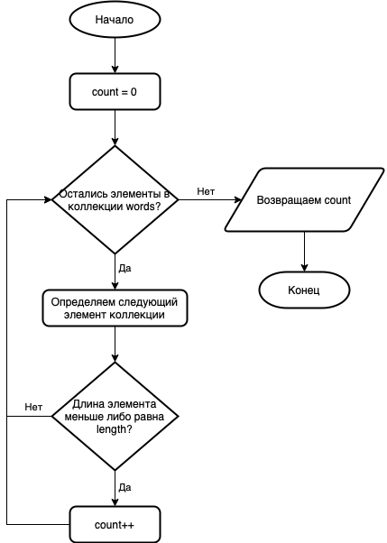
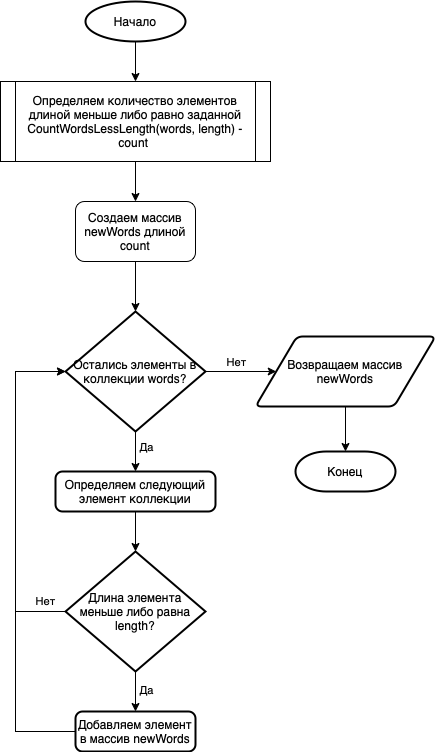
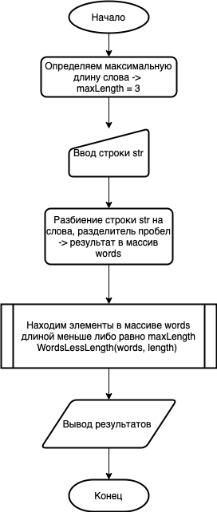

# Итоговая работа
## Условие задачи
>Написать программу, которая из имеющщегося массива строк формирует массив строк, длина которых меньше либо равна 3 символам. Первоначальный массив можно ввести с клавиатуры, либо задать на старте выполнения алгоритма. Для решения не рекомендуется пользоваться коллекциями,лучше обойтись исключительно массивами.
## Решение задачи
### Блок-схема метода *CountWordsLessLength*
Метод принимает принимает на вход строковый массив **words** и возвращает количество элементов длиной меньше либо равно **length** 

### Блок схема метода *WordsLessLength*
Метод принимает принимает на вход строковый массив **words** и возвращает строковый массив, состоящий из элементов длиной меньше либо равно **length** 

### Блок-схема основной программы

### Программа
Программа написана на языке c#.

_**[Листинг программы](/UpgradeStringArray/Program.cs)**_